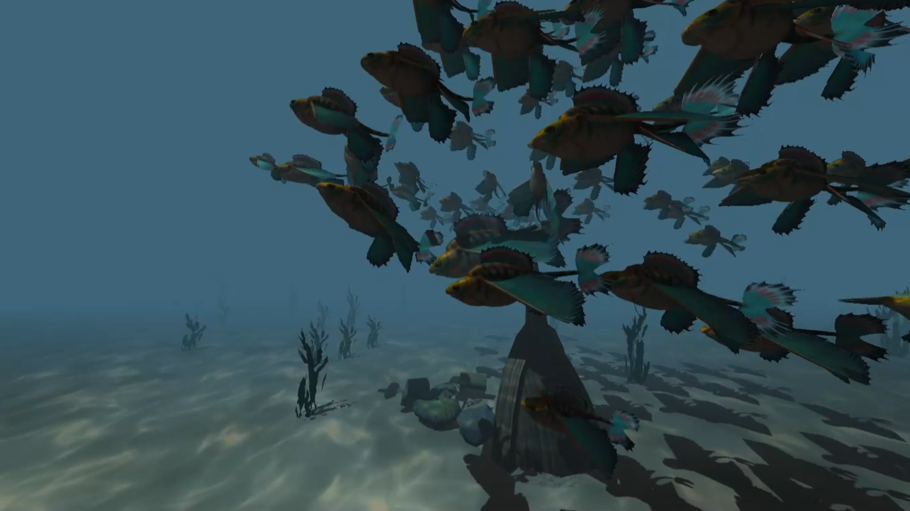
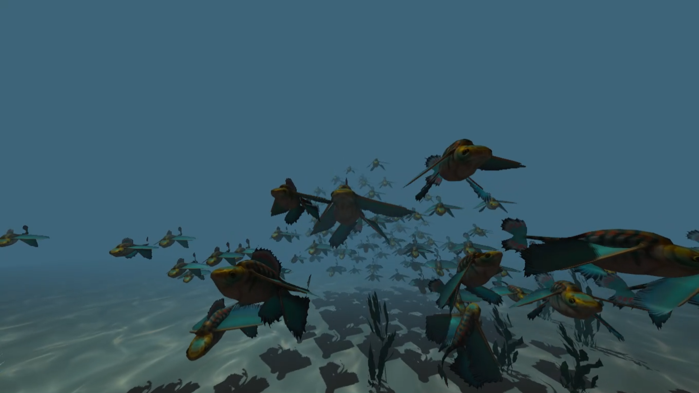
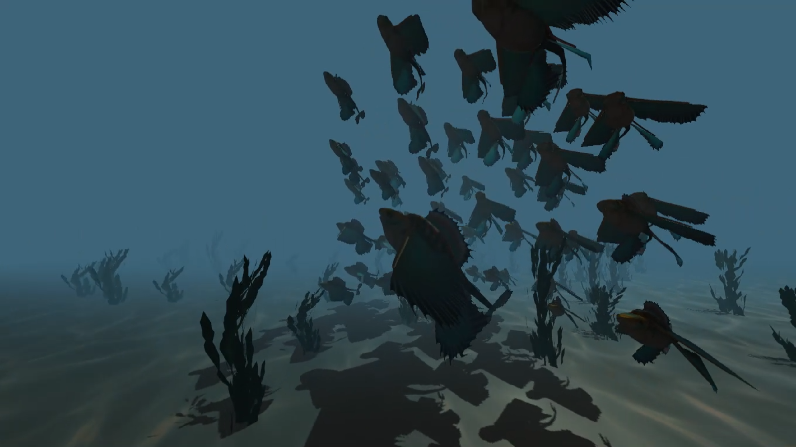
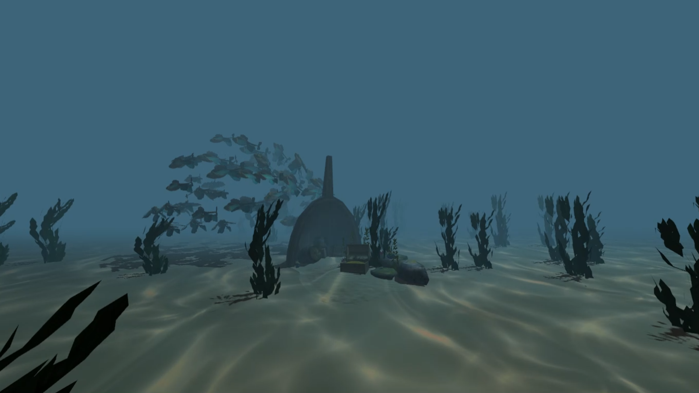

# Boids
Boids simulation program that I wrote to learn more about computer graphics.

Key features include:
- .OBJ model loading
- Textures and animations
- Phong shading
- Multiple cameras
- Fog
- Caustics
- Sounds

# Controls
- Change cameras with number keys 1 to 4:
    - 1: Behind the boids
    - 2: Parallel to the boids
    - 3: Centered around the ship in the middle of the map
    - 4: Free camera (move with IJKL)

- "+" and "-": increase or decrease the amount of fishes
- "T": Toggle directional light
- "F": Enable/disable fog
- Directional Keys: Move light source (i.e. the sun)
- F1 to F4: toggle boid movement rules
    - F1: Separation
    - F2: Cohesion
    - F3: Alignment
    - F4: Goal
- "P": Pause/unpause simulation
- "Shift + P": Enable/disable leader boid autopilot
- "WASD": Control leader boid when autopilot is disabled
- "Q" or "Esc": Close the application
- "Right mouse button": Debug info

# Images

  
  
  
  

# Video
https://drive.google.com/file/d/1b-2ZR5bTNAqT_bNybjNeVMOimkjMFxPX/view?usp=sharing